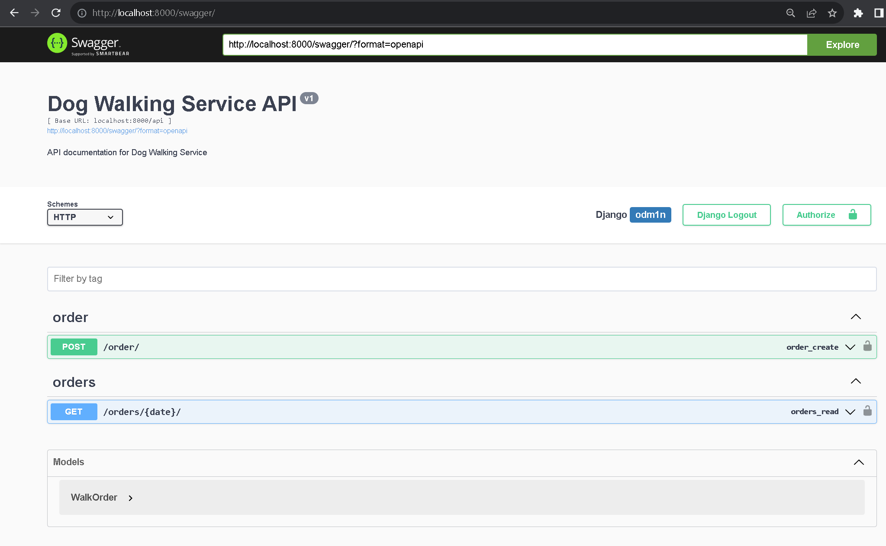
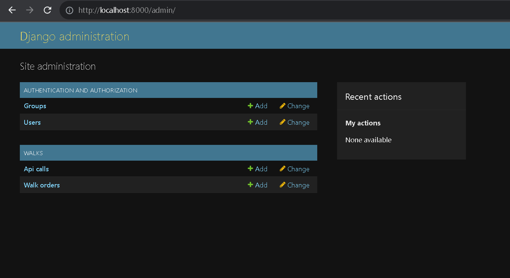
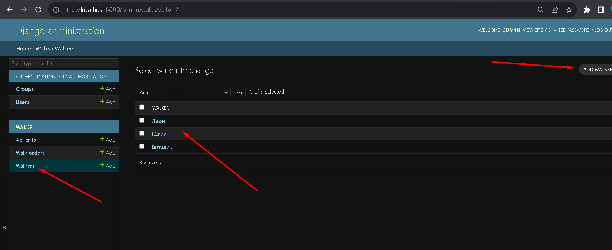
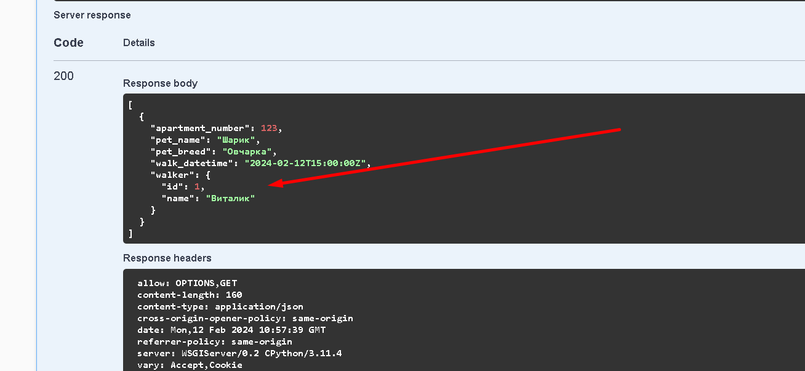

# Сервис API для выгульщиков собак

## Установка

Создайте виртуальное окружение и активируйте его:
```shell
python3 -m venv venv
source venv/bin/activate
```

Обновите pip и установите необходимые зависимости:
```shell
pip install --upgrade pip
pip install -r requirements.txt
```

База данных для этого сервиса по умолчанию использует SQLite3, что является удобным вариантом для разработки и тестирования. Если вы хотите использовать другую систему управления базами данных, вам необходимо изменить настройки в файле `settings.py` Django-проекта.

Найдите раздел `DATABASES` и измените конфигурацию в соответствии с вашими требованиями. Пример конфигурации для использования PostgreSQL приведен ниже:
```python
DATABASES = {
    'default': {
        'ENGINE': 'django.db.backends.postgresql',
        'NAME': 'имя_вашей_базы_данных',
        'USER': 'имя_пользователя',
        'PASSWORD': 'пароль',
        'HOST': 'localhost',  # Или IP адрес сервера базы данных, если он удаленный
        'PORT': '5432',  # Стандартный порт для PostgreSQL
    }
}
```

Запуск и тестирование проекта:

```shell
python manage.py makemigrations
python manage.py migrate

python manage.py createsuperuser # Создайте администратора

python manage.py runserver
```

## Админка доступна по URL:
[Админка сервиса](http://localhost:8000/admin/)
p.s. в админке так же предусмотренны логи запросов.

## Начать пользоваться сервисом можно с помощью Swagger:
[Swagger](http://localhost:8000/admin/)





## Обновление
При создании заказа теперь не требуется самому выбирать выгульщика. Сервис сам выберит свободного и назначит заказ на него.

Перед созданием нового заказа требуется через админку добавить имена всех выгульщиков в сервис:


И теперь после создания заказа, через Swagger можно будет увидеть результат работы по авто определению выгульщика:
